### Hi there 👋

#### Tech Blog Posts
- [MCPとAIエージェントを活用してSlackから複数CRMの顧客情報を横断検索できる仕組みを作った話](https://tech.findy.co.jp/entry/2025/07/08/070000)
- [Dataformの活用とその効果](https://tech.findy.co.jp/entry/2024/07/01/083000)

---

